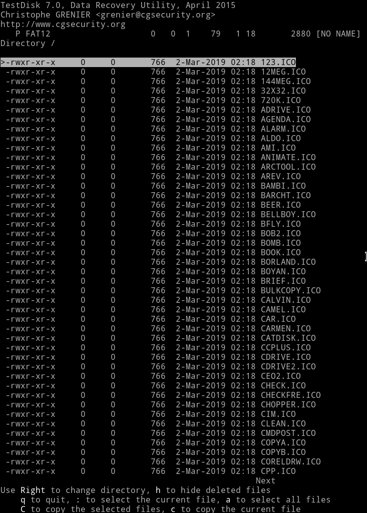

# Diskimage

__Problem__

Disk "image"

[diskimage.png](diskimage.png/)

__Solution__

Since the description says that there must be an "image" we start by looking into the hex values and after looking a bit you might see a a DOS sector in there. For OTA @unblvr did this process, actually he solved the whole challenge by himself :tada:

So using [zsteg](https://github.com/zed-0xff/zsteg) we can extract that DOS/MBR sector

```
➜ zsteg -a diskimage.png -e 'b8,rgb,lsb,xy' > diskimage.dat
```

Now using testdisk you can analyse the diskimage.dat and when you'll get into the `undelete` option you'll notice lots of icon



There's a deleted file named [`_LAG.ICO`](_LAG.ICO/_) you can copy that file using testdisk option.

Then you can simply run [stegoveritas](https://github.com/bannsec/stegoVeritas/) on the `_LAG.ICO` and you'll see the flag.

FLAG: `CTF{FAT12_FTW}`
