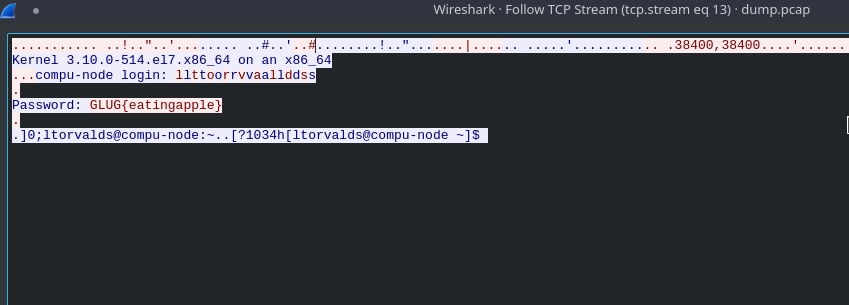

# Shh!

__PROBLEM__

Lixor secartely captured some network communications Over the Wire.
Here is the [dump](dump.pcap). May be you can find something interesting here?


__SOLUTION__

Open the given PCAP file in [wireshark](dump.pcap). You'll see lots of protocols. The interesting ones are the one named [`TELNET`](https://en.wikipedia.org/wiki/Telnet).
So search `Telnet` like


Well then all you have to do is find something interesting something like password or username etc.
Soon you'll notice an entry
```
350   21.373499   192.168.239.100 192.168.239.10  TELNET  68  Telnet Data ...
```

That have some field `password`, if you'll follow the `TCP` Stream of that entry you'll get to your destination:



FLAG - `GLUG{eatingapple}`
