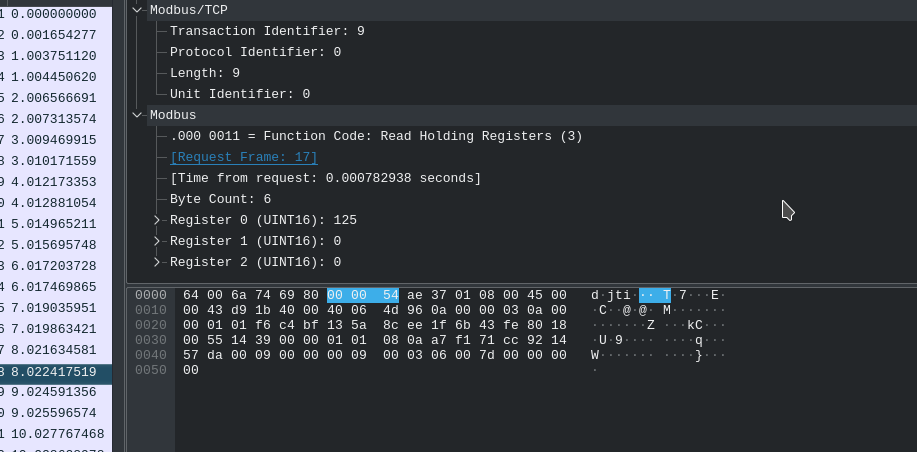

# Industrial process


__Description__

In company XXX, we have a big expertise in laser cutting and we are well informed about cybersecurity. We have setup a small honeypot to simulate the cut of some pieces. In our fake process, we have manufactured 25 pieces of 1 meter by 1 meter. We have found this really weird file thanks to a super effective detection tool. There was also a weird string :

893c539a84e6c96acf5f2ceea2ad9ef7be895580

This flag follow the following format : INSA([A-Z]*). Please submit it as INSA{$1}, for example if you find INSAAZERTY, submit INSA{AZERTY}. [Weird File](tempList.txt)


__SOLUTION__

At first I thought that it was a hash and we have to crack the hash. I didn't even looked at the given file.

After a while I realized that we are given a file(:facepalm:).

When I googled the strings/hash I came across this tool called [Cloakify](https://github.com/TryCatchHCF/Cloakify/).
Okay so that mean we have to use that tool somehow to proceed.

Reading the `README` file I realized what was supposed to be done.
Basically the given file will turn out to be something else when we will `decloakify` it.

```bash
➜ python2 decloakify.py tempList.txt ciphers/worldFootballTeams > pcap
```

This will give us a PCAP file.
When we open the file it give us some error about missing bytes, I thought WE'll have to fix that issue but then __@unblvr__ explained what might happened.

According to him
```
There's no missing data per se, it's just that the file stops suddenly
it could just be due to the creation process
I bet they didn't sniff some modbus connection, but crafted this with scapy or something
```

Okay that mean we didn't have to fix the PCAP then what do we do.

Well if we read the description the tool was `laser cutter` and if you look at those protocols `Modbus/TCP` there are `Register values` present.



So we need to extract those response values and analyze them.

```bash
➜ tshark -r pcap -Y modbus -T fields -E header=y -e frame.len -e modbus.regval_uint16
```

This will give us all those responses and since they are in tuple of 3 the best we could do is plot them on graph and see if it result in something.

First we put those values in a [file](pdus.txt).
Now you can just plot this using python.
Once plotted this will give you the flag.

Also all the part after the we found pcap was done by __@unblvr__
