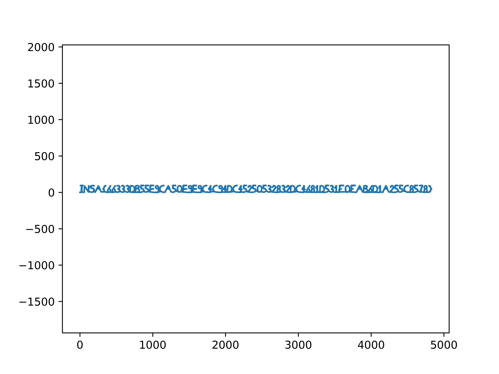

# Drone Motion

__DESCRIPTION__

We intercepted a drone flying above a restricted area and retrieved a [log](https://static.ctf.insecurity-insa.fr/5e97cfb3f4c64201c201a1703440c397f91be74b.tar.gz) from its memory card.

Help us find out what this drone was doing above our heads!

Flag must match the regex: INSA\{[a-f0-9]+\}

__SOLUTION__

This was a simple one we just simply had to plot the values of x, y, z to get the flag.

```python
import re
import matplotlib.pyplot as plt

lines = open("sensors.log").readlines()

coords = []
x_coords = []
y_coords = []
z_coords = []
cur_X,cur_Y,cur_Z = 0,0,0

for line in lines:
    match = re.findall("\[drone\]\(DEBUG\)> dir: \(x=(-?\d.\d+),y=(-?\d+.\d+),z=(-?\d.\d+)\)", line)
    if match:
        x,y,z = map(float, match[0])
        cur_X += x
        cur_Y += y
        cur_Z += z
        x_coords.append(cur_X)
        y_coords.append(cur_Y)
        z_coords.append(cur_Z)

ax = plt.plot(x_coords, y_coords, '-')
plt.axis('equal')
plt.savefig("test.png", dpi=1000)
```

This would give us the flag



This challenge was also solved by none other than __@unblvr__

`P.S` - In starting for some reason we were confused on with `E` and `F` but the later we realized that `F`'s middle line is smaller then `E`'s
