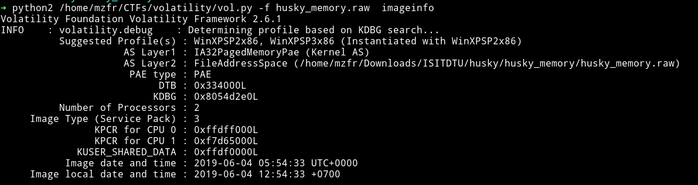
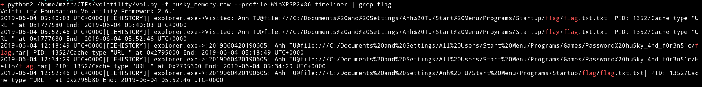
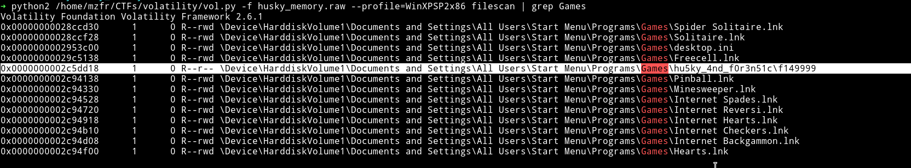
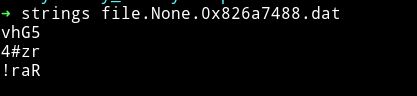
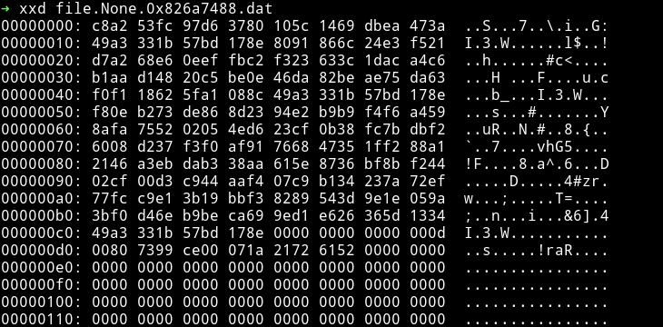
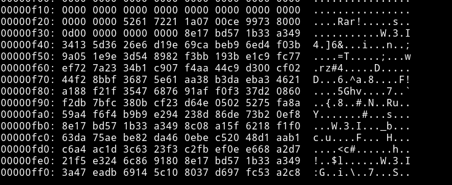
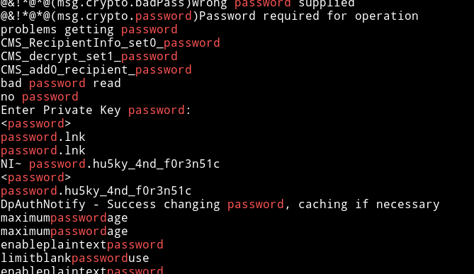

# Easy_Husky-1000

__Description__

I found someone using my personal computer to do something shady. Fortunately, I have recorded these actions in time, you can check what he did on my computer. The reward is a flag for you.

 [Download](https://mega.nz/#!O0FRHKQA!LpU14rCAOVlK7xSVbzqKa1G9TjVkLj6hKNX1vUZdcLQ)

__Solution__

This was really nice and easy challenge but I wasted hours on this one.

We are given a `.raw` file so we can use volatility on this one.



We can use `--profile=WinXPSP2x86` for further analysis.

Now if we focus on the description it says `I have recorded these actions in time` so I decided to use the [`timeliner`](https://github.com/volatilityfoundation/volatility/wiki/Command-Reference#timeliner) plugin.

At first it gave out lot of crap so I decided to grep it for `flag`.



There were two files refering to `flag` i.e `flag.txt.txt` and `flag.rar`.
So now we need to extract those files and see which one has the real flag.

This is where I wasted hours. For some reason I could't figure out how to dump those files :man_facepalming: even though it's like the basics of `volatility`. I knew I need to use [`dumpfiles`](https://github.com/volatilityfoundation/volatility/wiki/Command-Reference#dumpfiles) plugin but it kept on giving me shit load of output, which were hard to analyze.

After an hour or so I realised I can dump particular files providing the physical offset of those files and we can use the [`filescan`](https://github.com/volatilityfoundation/volatility/wiki/Command-Reference#filescan) plugin for that.

At first filescan gave lot of output so I grepped it for `Games` since the path we are looking for have `Games` in it.



we have the physical offset now, we can simply dump this file.


We expected a `rar` file but it's a general `.dat` file. Runing `Strings` on this file it shows the `rar` header.



This mean it's a rar file but a bit messed up. To see what's wrong with the file headers I used `xxd` command



as we can see the headers of the rar file is reversed meaning the very first pair should be `52` then `61` then `72` but that was in the end of the file.

Something like:



We can reverse the headers and then we can get the proper rar file. I was trying to do this via python code but __@pusher__ found a very quick and better solution.

```bash
< input.dat xxd -p -c1 | tac | xxd -p -r > file.rar
```
Using this we'll get the rar file and that rar is be password protected. I simply grepped the `.raw` file for `password`.



Using the password `hu5ky_4nd_f0r3n51c` we can extract the `flag.txt` from the `flag.rar`


**FLAG**: `ISITDTU{1_l0v3_huskyyyyyyy<3}`


***

Since the flag was in the `flag.rar` I decided to see what was in the `flag.txt.txt`. After dumping that file and running strings on it I found a fake flag `ISITDTU{f4k3_flagggggggggggggggggggggggg}`.

You can also find this fake flag by using `strings` on the main memory dump and grepping for `ISITDTU`
