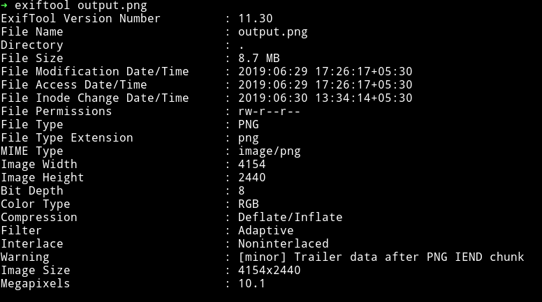
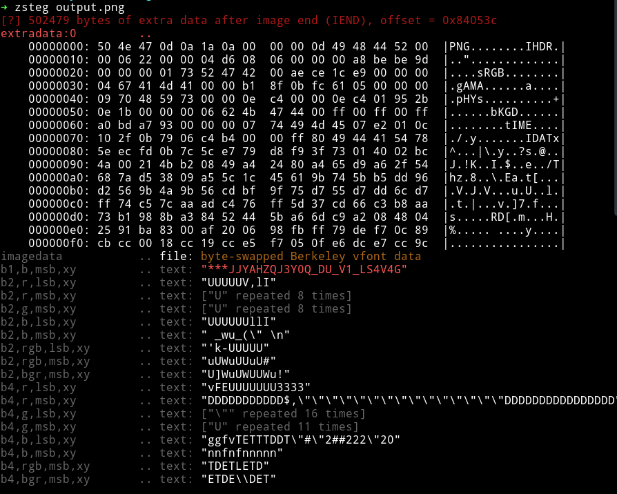
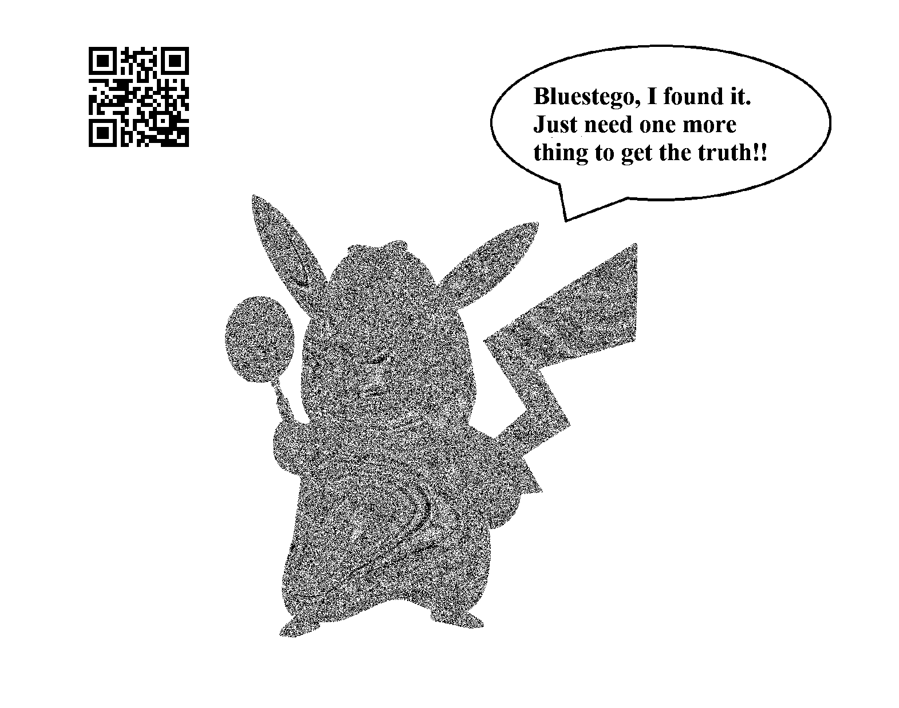
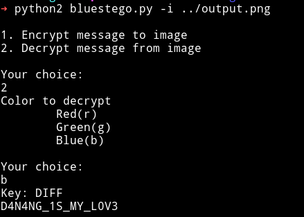

# acronym-1000

__Description__

An acronym is a word or name formed as an abbreviation from the initial components of a phrase...
You will need that.
Detective Pi
[Output.png](Images/output.png)

Note: The flag is not in flag format, please wrap it in format when you submit.

__Solution__

We are given a PNG file , So I started as I usually do i.e using `stegoveritas` on the image. It gave out some trailing data but it was kinda junk.

I looked at the exif of the image and it said theres some extra data after `IEND` chunk.



Since this is a `png` we cannot use `steghide` on this but we can try to use `zsteg`.



We can see that zsteg emits out the extra data and it looks like it's another PNG file. We can extract it properly and keep it in a file.

```bash
➜ zsteg -E "extradata:0" output.png > extracted.png
```

But this new image is broken. Let's see what's missing in this image.

```bash
➜ xxd -l8 extracted.png
00000000: 504e 470d 0a1a 0a00                      PNG.....
```

The actual PNG header is `8950 4e47` like in the original `output.png`

```bash
➜ xxd -l8 output.png
00000000: 8950 4e47 0d0a 1a0a                      .PNG....
```
You can open the `extracted.png` in hex editor and add `89` in the starting.
That will give you a proper image having a [`pikachu`](Images/pikachu.png)


Again used `stegoveritas` on that pikachu image and it gave out an image with QR.



Scanning that QR code we get `http://www.diff.vn/en/`. Visting that website was deadend. So we focus on the text in that pikachu image.

```
Bluestego, I found it.Just need one more thing to get the truth!!
```

So I google `bluestego` and found [BinhHuynh/bluestego](https://github.com/BinhHuynh2727/BlueStego)

First we(me and __@UnblvR__) tried to use the script on the `pikachu` image and got nothing. Then __@UnblvR__ was able to figure out that we need to use it on the original image i.e `output.png`. And also he figure out that the key should be `DIFF` on the `blue` bit.



**FALG**: `ISITDTU{D4N4NG_1S_MY_L0V3}`


