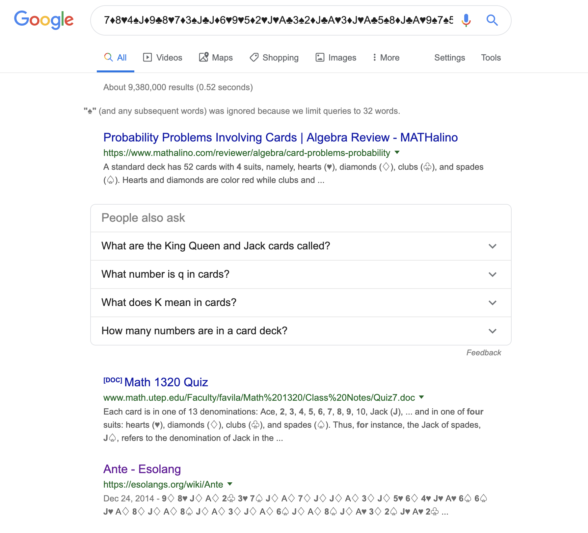

# poker_game-1000

__Description__

I know how to play cards but I'm not a professional player, you can https://www.youtube.com/watch?v=-nS1r-EwDnk

 File: [Poker](poker)

__Solution__

The file contatins

```
7♦8♥4♠J♦9♣8♥7♦3♠J♣J♦6♥9♥5♦2♥J♥A♣3♠2♦J♣A♥3♦J♥A♣5♠8♦J♣A♥9♠7♠5♦J♥J♥A♦3♠6♦J♦A♣5♦5♦J♣A♥2♠3♦J♥A♥2♠3♦J♥7♠3♥5♥J♠A♦3♠J♦A♥2♦2♦J♥A♦9♦8♦J♦A♠8♠J♠A♦5♠9♠J♦A♦2♠J♦A♥2♦J♥A♠7♦J♠A♠6♦3♠J♠A♣2♠J♣A♠7♠2♠J♠A♦2♠7♦9♦J♦A♦3♦J♦A♥3♦J♥A♣2♠J♣A♠9♦2♦J♠J♠A♠4♠4♠J♠A♣6♦J♣A♣3♠J♣A♠6♦5♠J♠A♣5♠4♦J♣A♠2♠3♦J♠A♦2♣7♦8♦J♦A♣5♠5♠J♣A♥5♠J♥A♦5♣J♦
```

First I thought this was a [`solitaire cipher`](https://steemit.com/steemiteducation/@shai-hulud/solitaire-encryption-low-tech-high-security-a-how-to) and was trying to read about it but then __@blackpink__ pointed out that it's not `Crypto` challenge so we should look at something else.

So I started looking for any `esolang` but couldn't find any. And then __@blackpink__ strikes again. They found it just by googling the whole cipher.



Then we found the [github/michaeldv/ante](https://github.com/michaeldv/ante).

Using the `ante.go` we were able to decode the cipher to a base58 string

```console
➜ go run ante.go ../poker
4L4vKyNnn7Xopi4tEa75vhkVbCFyTmmeZWfVg2Lt
```

Decode that base58 and you got yourself a flag.

**FLAG**: `ISITDTU{1_l0v3_4nt3_l4ngu4g3}`
