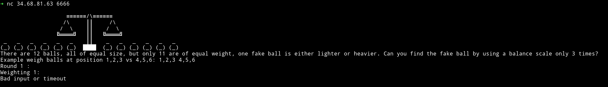
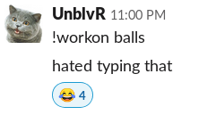

# balls-1000

__Description__

There are 12 balls, all of equal size, but only 11 are of equal weight, one fake ball is either lighter or heavier. Can you find the fake ball by using a balance scale only 3 times?

`nc 34.68.81.63 6666`

__Solution__

If we connect to the server we get something like



We just need to find the ligther or heavier ball.

You can read about this problem on [wikipedia/Balance_puzzle](https://en.wikipedia.org/wiki/Balance_puzzle)

__@comet__ was able to create a [script](balls.py) to solve this

```python
#https://wordplay.blogs.nytimes.com/2014/07/21/12coin/
from pwn import *
r = remote('34.68.81.63', 6666)
for i in range(9):
    r.recvline()
while True:
    print(r.recvline()) # ROUND
    ans = 0
    r.sendlineafter(': ','1,2,3,4 5,6,7,8')
    print('1,2,3,4 5,6,7,8')
    s = r.recvline()
    print(s)
    if 'equally' in s:
        r.sendlineafter(': ','9,10,11 1,2,3')
        print('9,10,11 1,2,3')
        s = r.recvline()
        print(s)
        if 'equally' in s:
            ans = 12
            r.sendlineafter(': ','1 2')
        elif 'left is lighter' in s:
            r.sendlineafter(': ','9 10')
            print('9 10')
            s = r.recvline()
            print(s)
            if 'equally' in s:
                ans = 11
            elif 'left is lighter' in s:
                ans = 9
            else:
                ans = 10
        else:
            r.sendlineafter(': ','9 10')
            print('9 10')
            s = r.recvline()
            print(s)
            if 'equally' in s:
                ans = 11
            elif 'left is lighter' in s:
                ans = 10
            else:
                ans = 9
    elif 'left is lighter' in s:
        r.sendlineafter(': ','1,2,5 3,4,6')
        print('1,2,5 3,4,6')
        s = r.recvline()
        print(s)
        if 'equally' in s:
            r.sendlineafter(': ','7 8')
            print('7 8')
            s = r.recvline()
            print(s)
            if 'left is lighter' in s:
                ans = 8
            else:
                ans = 7
        elif 'left is lighter' in s:
            r.sendlineafter(': ','1 2')
            print('1 2')
            s = r.recvline()
            print(s)
            if 'equally' in s:
                ans = 6
            elif 'left is lighter' in s:
                ans = 1
            else:
                ans = 2
        else:
            r.sendlineafter(': ','3 4')
            print('3 4')
            s = r.recvline()
            print(s)
            if 'equally' in s:
                ans = 5
            elif 'left is lighter' in s:
                ans = 3
            else:
                ans = 4
    else:
        r.sendlineafter(': ','1,2,5 3,4,6')
        print('1,2,5 3,4,6')
        s = r.recvline()
        print(s)
        if 'equally' in s:
            r.sendlineafter(': ','7 8')
            print('7 8')
            s = r.recvline()
            print(s)
            if 'left is lighter' in s:
                ans = 7
            else:
                ans = 8
        elif 'left is lighter' in s:
            r.sendlineafter(': ','3 4')
            print('3 4')
            s = r.recvline()
            print(s)
            if 'equally' in s:
                ans = 5
            elif 'left is lighter' in s:
                ans = 4
            else:
                ans = 3
        else:
            r.sendlineafter(': ','1 2')
            print('1 2')
            s = r.recvline()
            print(s)
            if 'equally' in s:
                ans = 6
            elif 'left is lighter' in s:
                ans = 2
            else:
                ans = 1
    print(ans)
    r.sendlineafter(':\n',str(ans))
    print(r.recvline())
```

You can run this script in the `DEBUG` mode, it will run for `50 ROUNDS`

**FLAG**: `ISITDTU{y0u_hav3_200iq!!!!}`

***

Something funnier that happend while people were joining the channel for this challenge.


