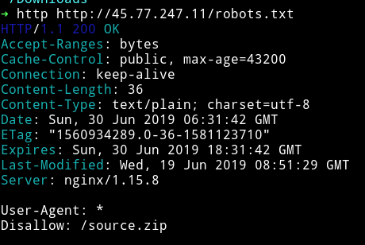
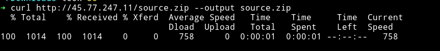
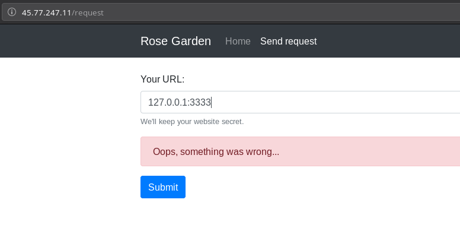
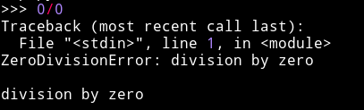
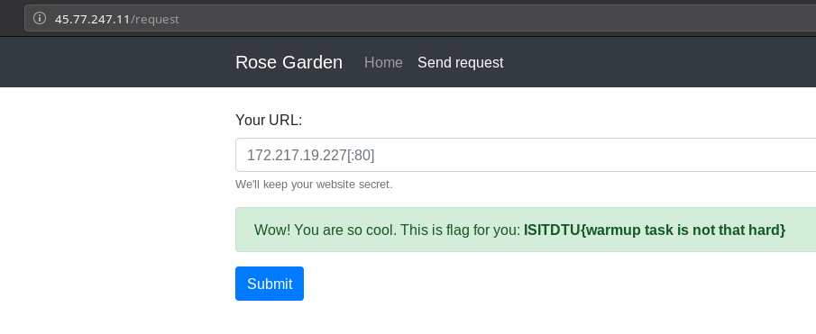

# rosegarden - 1000

__Description__

Rosé is a beautiful singer with a sweet voice, but she is so much busy and she needs more staff to work in her garden. http://45.77.247.11/

__Solution__

Visiting the website we can see there are images of girl named `Rose`. And there's a option on `/request` to send some requests which seems the only interesting thing about the website.

After some more recom we find that there's a `robots.txt` on the website and accessing that URL we find `source.zip`



We can download the source using `curl` or by visiting the http://45.77.247.11/source.zip in your browser.



Inside that zip is a [`app.py`](app.py), Looking at the source we can see that we have to send the request from `127.0.0.1:3333` but if we do that we get an error



That's because there are few checks performed in `check_func` function.

```python
async def check_func(hostname, port):
    try:
        if len(hostname.split('.')) != 4: 0/0

        if '127.' in hostname or '.0.' in hostname or '.1' in hostname: 0/0

        if inet_aton(hostname) != b'\x7f\x00\x00\x01': 0/0

        if not port: port = 80

        result = []
        with ThreadPoolExecutor(max_workers=3) as executor:
            loop = asyncio.get_event_loop()
            tasks = [
                loop.run_in_executor(
                    executor,
                    lambda u: requests.get(u, allow_redirects=False, timeout=2),
                    url
                ) for url in [f'http://{hostname}:{port}', 'http://127.0.0.1:3333']
            ]
            for res in await asyncio.gather(*tasks):
                result.append(res.text)
    except:
        return False

    return result[1] if result[0] == result[1] else False
```

* `if len(hostname.split('.')) != 4: 0/0`

    This checks that the length of the hostname must be `4` or it will raise `dividing by zero error`

    

* `if not port: port = 80`

    If port not given then take port to be `80`

* `if '127.' in hostname or '.0.' in hostname or '.1' in hostname: 0/0`

    This check is the main and important check. This check that there should be `127.` or `.0.` or `.1` in the hostname else it will raise `ZeroDivisionError`

This check can easily be bypassed but using the octal or hex representation of `127.0.0.1`. We used octal representation for this `0177.00.00.01:3333`




**FLAG**: `ISITDTU{warmup task is not that hard}`
