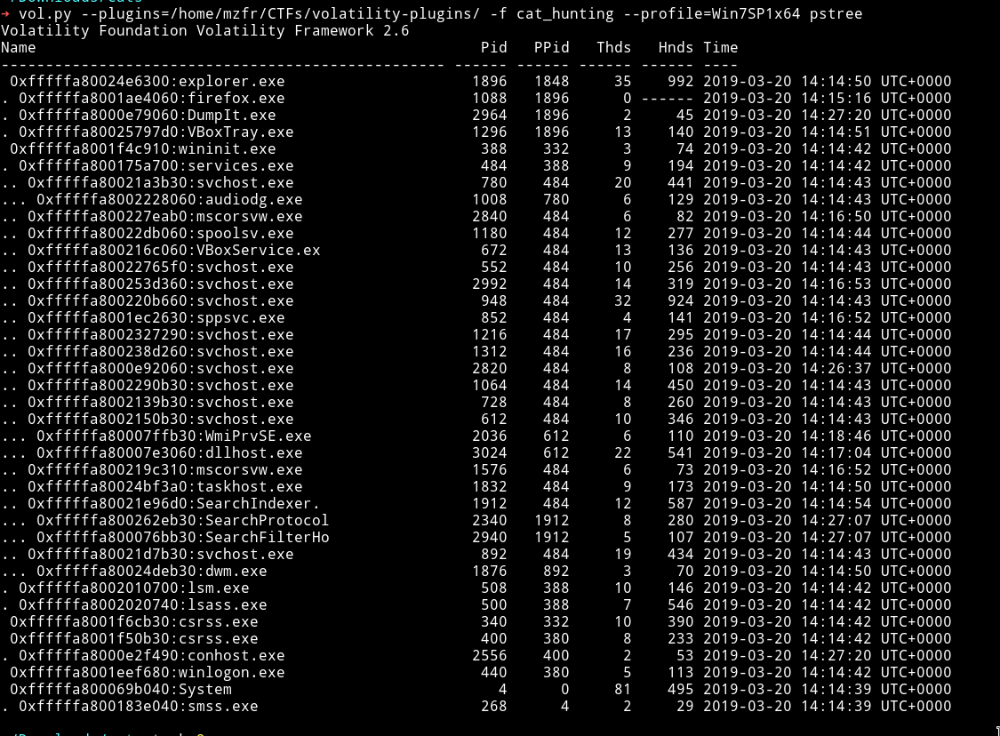
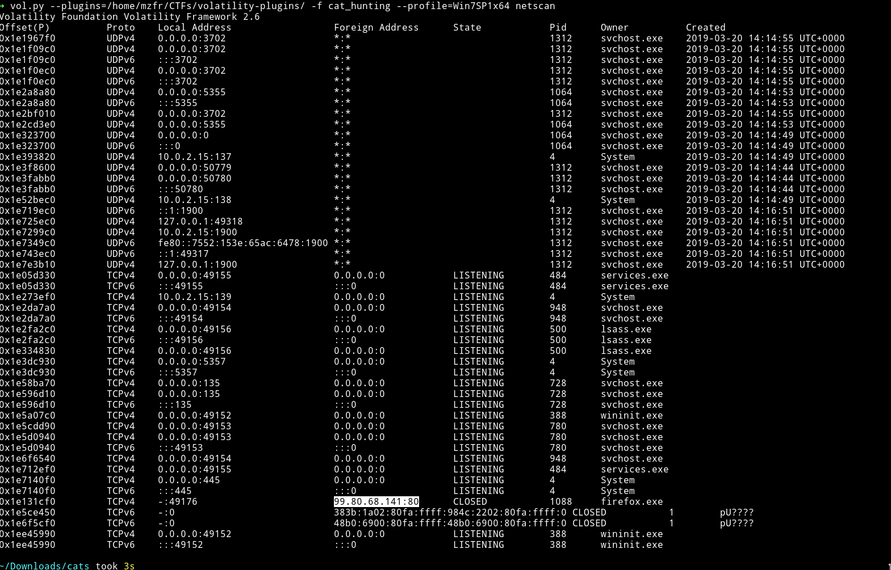
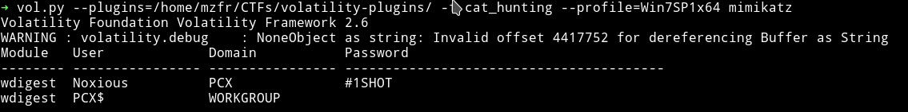
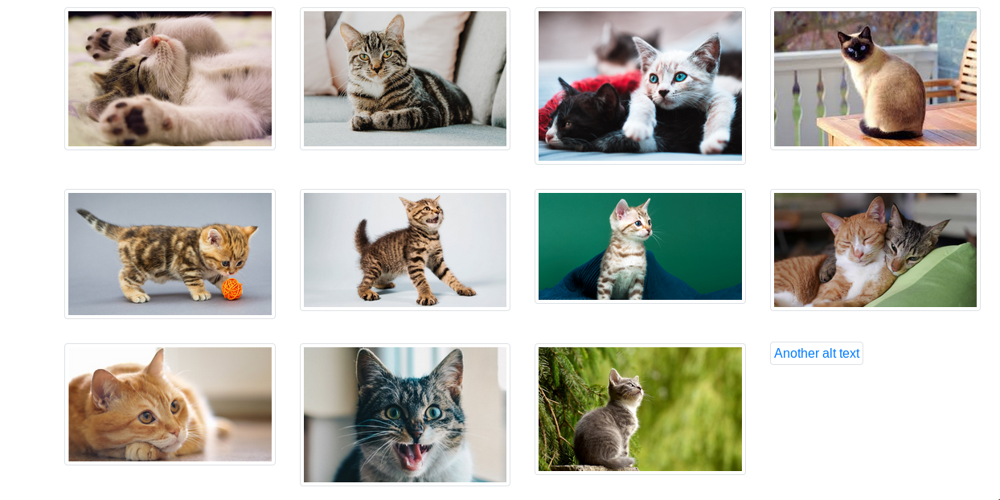

# Cat hunting

__PROBLEM__

We got an anonymous note that a student is downloading illegal contents like 'cat pictures' ! We confiscated his PC and got a memory dump before returning it. Your job now is to follow his traces and find out how he gets them.

[Link](http://www.mediafire.com/file/60dkm1poq7uy2oo/cat_hunting.zip/file)


__SOLUTION__

This was very bad challenges maybe because of the description or I don't know what but it was just bad.

Wasted few hours after that we found the right path.

So we are given the memdump so let start with simple `imageinfo`

```bash
➜ vol.py -f cat_hunting imageinfo
Volatility Foundation Volatility Framework 2.6
INFO    : volatility.debug    : Determining profile based on KDBG search...
          Suggested Profile(s) : Win7SP1x64, Win7SP0x64, Win2008R2SP0x64, Win2008R2SP1x64_23418, Win2008R2SP1x64, Win7SP1x64_23418
                     AS Layer1 : WindowsAMD64PagedMemory (Kernel AS)
                     AS Layer2 : FileAddressSpace (/home/mzfr/Downloads/cats/cat_hunting)
                      PAE type : No PAE
                           DTB : 0x187000L
                          KDBG : 0xf800027f90a0L
          Number of Processors : 1
     Image Type (Service Pack) : 1
                KPCR for CPU 0 : 0xfffff800027fad00L
             KUSER_SHARED_DATA : 0xfffff78000000000L
           Image date and time : 2019-03-20 14:27:22 UTC+0000
     Image local date and time : 2019-03-20 15:27:22 +0100
```

So let's do the `pstree` to see what all process are running:



We can see that firefox is running and if someone was downloading an image it must be through the browser. So let's dump firefox history by using the firefoxhistory plugin.

I tried but I got nothing. I tried dumping the firefox process but failed. Tried looking into the memory of the dump but nothing.

Then after some time we decided to trace back the firefox, see what trace it has left.

Running netscan, gives us the `IP`



I tried that IP and that host was up and I was prompted a login page.


If the host is up and we were asked to find the origin of the images in the description then we might have to login to get the flag. But in order to do so we need logins. Let's try `mimikatz` plugin.



Now we have the creds and the url so we login into the account and find lot of images there but one wasn't rendering properly.



So we visit the URL and save it and after opening that file we get a b64

```
c2VjdXJpbmV0c3tkMjU3MzZmZWJmZDgwOWVjNGViYTc2YjBhYWU5ZWFiMH0K
```

Decode it

```bash
➜ echo "c2VjdXJpbmV0c3tkMjU3MzZmZWJmZDgwOWVjNGViYTc2YjBhYWU5ZWFiMH0K" | base64 -d
securinets{d25736febfd809ec4eba76b0aae9eab0}
```

FLAG - <span style="color: red">`securinets{d25736febfd809ec4eba76b0aae9eab0}`</span>
