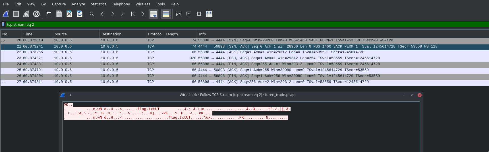
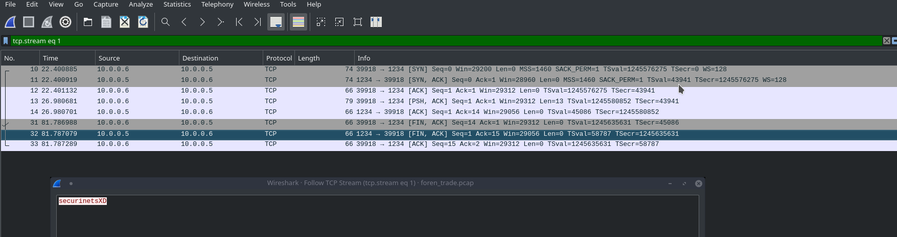

# Easy Trade

__PROBLEM__

We just intercepted some newbies trying to trade flags.

Author: bibiwars
[foren_trade](foren_trade.pcap)

__SOLUTION__

Opening the file in wireshark we see that there's quite a few protocols but we focused on the TCP.

I randomly followed a TCP protocol in starting and it said

```
give me the key
Okay, listen on 4444 for the flag
```


So I decided to follow the TCP on port 4444 and we see that there is some zip data. We the hex values in a file.




Then
```
>>> xxd -r -p file > for.zip
```

This will form the zip file but the file is password protected. First I thought of running John on it but then I decided to look into the remaining TCP packets and there I found the password.



There you'll find the base64 of the flag
```
c2VjdXJpbmV0c3s5NTRmNjcwY2IyOTFlYzI3NmIxYTlmZjg0NTNlYTYwMX0
```

Decode it
```
➜ echo "c2VjdXJpbmV0c3s5NTRmNjcwY2IyOTFlYzI3NmIxYTlmZjg0NTNlYTYwMX0" | base64 -d
securinets{954f670cb291ec276b1a9ff8453ea601}
```

FLAG - `securinets{954f670cb291ec276b1a9ff8453ea601}`
