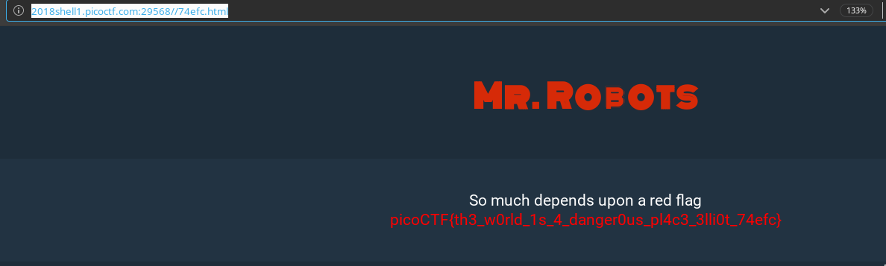

# Mr. Robot

__PROBLEM__

Do you see the same things I see? The glimpses of the flag hidden away? http://2018shell1.picoctf.com:29568 ([link](http://2018shell1.picoctf.com:29568))

__HINT__

What part of the website could tell you where the creator doesn't want you to look?

__SOLUTION__

No it has nothing to do with the show :smile:

Name of the challenge gives you an idea of checking the [robot.txt](https://moz.com/learn/seo/robotstxt). So visit `http://2018shell1.picoctf.com:29568/robots.txt` and you'll see that there is a url that is been `Diallow`. Visiting that (`http://2018shell1.picoctf.com:29568//74efc.html`) URL will lead to the flag.

FLAG - `picoCTF{th3_w0rld_1s_4_danger0us_pl4c3_3lli0t_74efc}`
